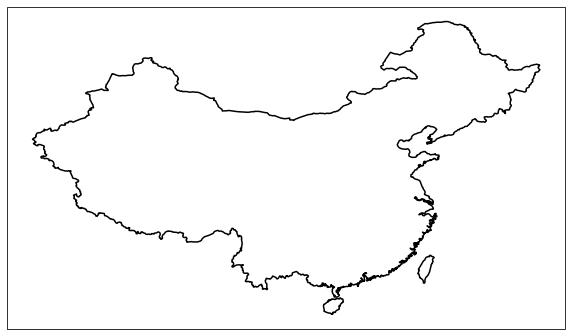
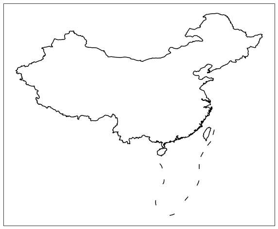
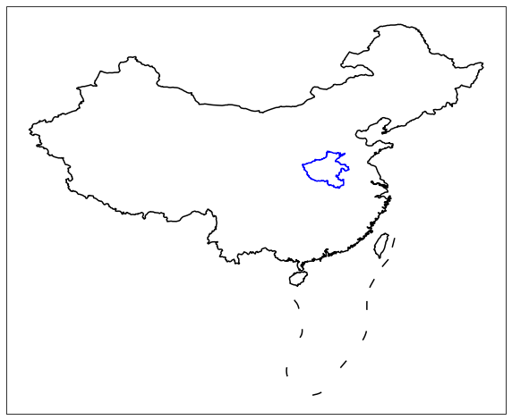
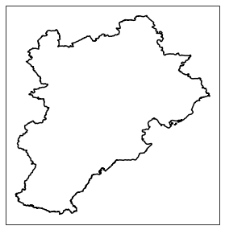
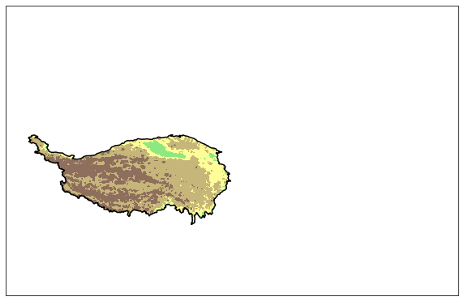
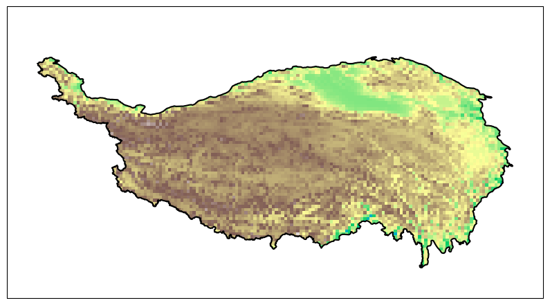
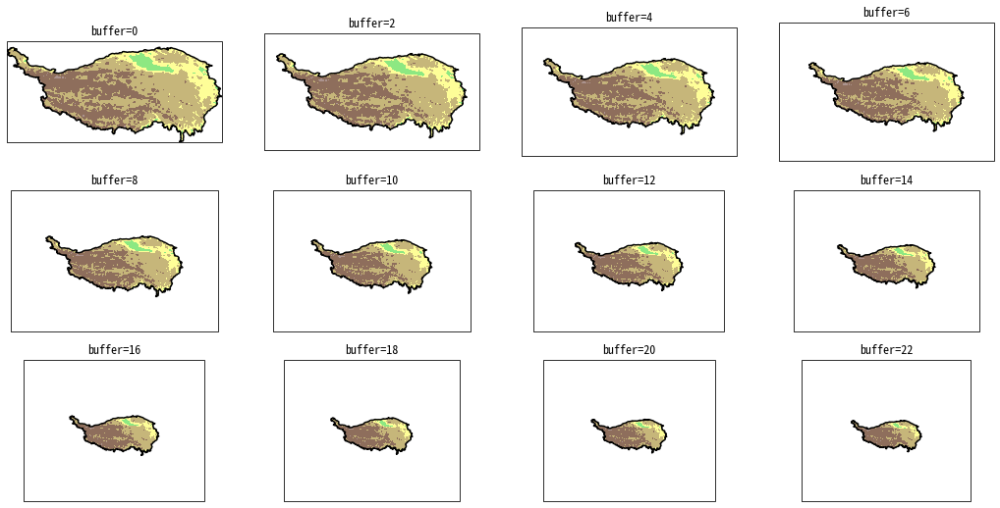
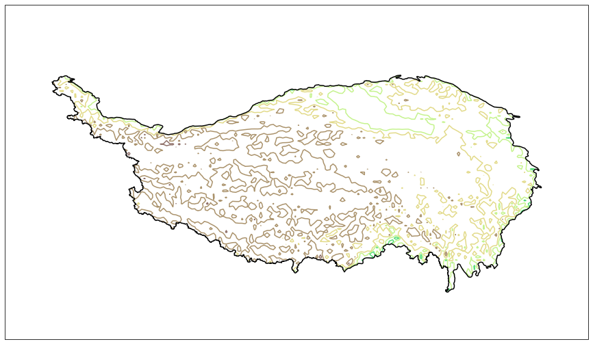
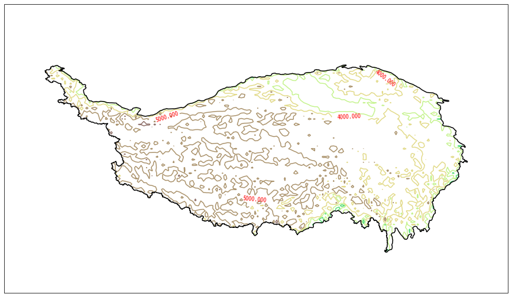
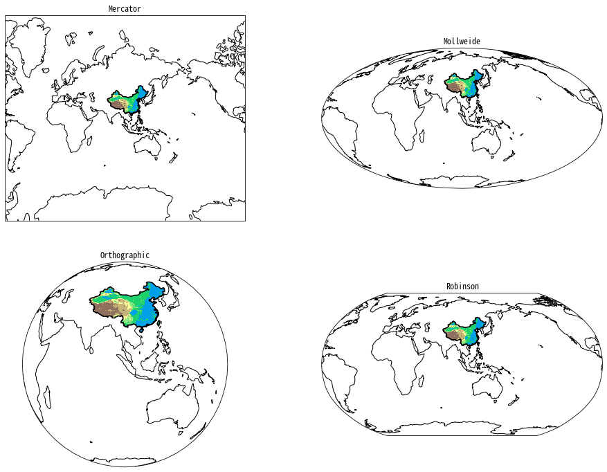

# cnmaps

<h1 align="center" style="margin:1em;">
  <a href="https://scitools.org.uk/cartopy/docs/latest/">
    </a>
</h1>


<p align="center">

<a href="https://app.travis-ci.com/github/Clarmy/cnmaps">
</a>

<!-- [](https://app.travis-ci.com/github/Clarmy/cnmaps) -->

<a href="https://badge.fury.io/py/cnmaps">
</a>

<!-- [](https://badge.fury.io/py/cnmaps) -->

<!-- [](https://pepy.tech/project/cnmaps) -->

<a href="https://pepy.tech/project/cnmaps">
</a>

<!-- [](https://github.com/Clarmy/cnmaps/issues) -->

<a href="https://github.com/Clarmy/cnmaps/issues">
</a>

</p>
<br>

<h4 align="center">
    cnmaps是一个可以让中国地图画起来更丝滑的python包（基于matplotlib和cartopy）
</h4>


## 安装

你可以使用pip进行安装：`$ pip install -U cnmaps`

## 使用

### 快速开始

用最简单直接的方式，来绘制你的第一张中国地图。   

```python
import cartopy.crs as ccrs
import matplotlib.pyplot as plt
from cnmaps import get_map, draw_map

fig = plt.figure(figsize=(10,10))
ax = fig.add_subplot(111, projection=ccrs.PlateCarree())

draw_map(get_map('中国'), color='k') 
# 注意，该版本的中国是简化版的，仅包括了主要陆地，如果想用完整版，请使用 get_map('中国2')，但是完整版中国地图的绘制会很慢。

plt.show()
```



### 绘制南海

现在我们可以把南海九段线加上。

```python
import cartopy.crs as ccrs
import matplotlib.pyplot as plt
from cnmaps import get_map, draw_map

fig = plt.figure(figsize=(10,10))
ax = fig.add_subplot(111, projection=ccrs.PlateCarree())
draw_map(get_map('中国'), color='k')
draw_map(get_map('南海'), color='k')

plt.show()
```



### 绘制各省地图

cnmaps还可以绘制各省（特区/直辖市）的地图

```python
import cartopy.crs as ccrs
import matplotlib.pyplot as plt
from cnmaps import get_map, draw_map

fig = plt.figure(figsize=(10,10))
ax = fig.add_subplot(111, projection=ccrs.PlateCarree())
draw_map(get_map('中国'), color='k')
draw_map(get_map('南海'), color='k')
draw_map(get_map('河南'), color='b')

plt.show()
```


### 合并省界

cnmaps可以将多个省（特区/直辖市）合并起来，例如我们可以用很简单的方式来可以绘制一张京津冀的轮廓图。

```python
import cartopy.crs as ccrs
import matplotlib.pyplot as plt
from cnmaps import get_map, draw_map

jingjinji = get_map('北京') + get_map('天津') + get_map('河北')

fig = plt.figure(figsize=(10,10))
ax = fig.add_subplot(111, projection=ccrs.PlateCarree())
draw_map(jingjinji, color='k')

plt.show()
```



### 绘制青藏高原

cnmaps还内置了青藏高原的边界。   


```python
import cartopy.crs as ccrs
import matplotlib.pyplot as plt
from cnmaps import get_map, draw_map

fig = plt.figure(figsize=(10,10))
ax = fig.add_subplot(111, projection=ccrs.PlateCarree())
draw_map(get_map('青藏高原', map_set='geography'), color='k')

plt.show()
```


### 根据边界裁减填色等值线图

cnmaps可以利用地图边界对等值线图进行裁减，只需要一个`clip_contours_by_map`函数即可。

```python
import cartopy.crs as ccrs
import matplotlib.pyplot as plt
from cnmaps import get_map, draw_map, clip_contours_by_map
from cnmaps.sample import load_dem

lons, lats, dem = load_dem()
fig = plt.figure(figsize=(10,10))

tp = get_map('青藏高原', map_set='geography')

ax = fig.add_subplot(111, projection=ccrs.PlateCarree())
cs = ax.contourf(lons, lats, dem, cmap=plt.cm.terrain)
clip_contours_by_map(cs, tp)
draw_map(tp, color='k')
```



### 根据边界裁减填色网格图

同样地，cnmaps也可以对网格图进行裁减，使用`clip_pcolormesh_by_map`函数即可。

```python
import cartopy.crs as ccrs
import matplotlib.pyplot as plt
from cnmaps import get_map, draw_map, clip_pcolormesh_by_map
from cnmaps.sample import load_dem

lons, lats, dem = load_dem()
fig = plt.figure(figsize=(10, 10))

tp = get_map('青藏高原', map_set='geography')

ax = fig.add_subplot(111, projection=ccrs.PlateCarree())
mesh = ax.pcolormesh(lons, lats, dem, cmap=plt.cm.terrain)
clip_pcolormesh_by_map(mesh, tp)
draw_map(tp, color='k')
ax.set_extent(tp.get_extent())
```



### 调整图片边界位置

我们可以利用`get_extent`方法获取不同缩放等级的边界，例如下图，我们用12个不同等级的缩放来绘制青藏高原的海拔高度图

```python
import cartopy.crs as ccrs
import matplotlib.pyplot as plt
from cnmaps import get_map, draw_map, clip_contours_by_map
from cnmaps.sample import load_dem

lons, lats, dem = load_dem()
fig = plt.figure(figsize=(12,6))
fig.tight_layout()

tp = get_map('青藏高原', map_set='geography')

for i in range(12):
    ax = fig.add_subplot(3,4,i+1, projection=ccrs.PlateCarree())
    cs = ax.contourf(lons, lats, dem, cmap=plt.cm.terrain)
    clip_contours_by_map(cs, tp)
    draw_map(tp, color='k')
    ax.set_extent(tp.get_extent(buffer=i*2))
    plt.title(f'buffer={i*2}')

plt.show()
```


### 剪切等值线图

除了填色等值线，非填色的等值线也可以直接用`clip_contours_by_map`进行剪切。

```python
import cartopy.crs as ccrs
import matplotlib.pyplot as plt
from cnmaps import get_map, draw_map, clip_contours_by_map
from cnmaps.sample import load_dem

lons, lats, dem = load_dem()
fig = plt.figure(figsize=(18, 9))
fig.tight_layout()

tp = get_map('青藏高原', map_set='geography')

ax = fig.add_subplot(111, projection=ccrs.PlateCarree())
cs = ax.contour(lons, lats, dem, cmap=plt.cm.terrain)
clip_contours_by_map(cs, tp)
draw_map(tp, color='k')
ax.set_extent(tp.get_extent(buffer=3))

plt.show()
```



### 对label的裁减

cnmaps的`clip_clabels_by_map`函数可以对超出边界的等值线标签进行裁减

**注意！由于Cartopy自身的设计缺陷，在`0.18.0`版本中，Cartopy重写的`clabel`方法不返回Label Text对象，因此在该版本中`clip_clabels_by_map`函数无法生效，在`0.19.0`中修复了这个bug，所以请尽量使用`0.19.0`及以上版本。**

```python
import cartopy.crs as ccrs
import matplotlib.pyplot as plt
from cnmaps import get_map, draw_map, clip_contours_by_map
from cnmaps.sample import load_dem

lons, lats, dem = load_dem()
fig = plt.figure(figsize=(18, 9))
fig.tight_layout()

tp = get_map('青藏高原', map_set='geography')

ax = fig.add_subplot(111, projection=ccrs.PlateCarree())
cs = ax.contour(lons, lats, dem, cmap=plt.cm.terrain)
clip_contours_by_map(cs, tp)

cb = ax.clabel(cs, colors='r')
clip_clabels_by_map(cb, tp)

draw_map(tp, color='k')
ax.set_extent(tp.get_extent(buffer=3))

plt.show()
```



### 变换投影

上述的功能在其他投影下也都适用，我们用四种投影来展示一下变换投影的效果。

```python
import cartopy.crs as ccrs
import matplotlib.pyplot as plt
from cnmaps import get_map, draw_map, clip_contours_by_map
from cnmaps.sample import load_dem

lons, lats, dem = load_dem()

PROJECTIONS = [
    ('Mercator', ccrs.Mercator(central_longitude=100)),
    ('Mollweide', ccrs.Mollweide(central_longitude=100)),
    ('Orthographic', ccrs.Orthographic(central_longitude=100)),
    ('Robinson', ccrs.Robinson(central_longitude=100))
]

fig = plt.figure(figsize=(16, 12))
fig.tight_layout()

china = get_map('中国')

for i, prj in enumerate(PROJECTIONS):
    ax = fig.add_subplot(2,2,i+1, projection=prj[1])
    cs = ax.contourf(lons, lats, dem, cmap=plt.cm.terrain, transform=ccrs.PlateCarree())
    clip_contours_by_map(cs, china)

    draw_map(china, color='k')
    ax.set_extent(china.get_extent(buffer=3))
    ax.set_global()
    ax.coastlines()
    plt.title(prj[0])

plt.show()
```



## 引用

本项目适用的地图边界的数据源包括：
1. 谢栋灿. 高德行政区边界获取与整理（shp格式）[EB/OL]. [2017.11.05]. http://i.xdc.at/2017/11/05/amap-district-to-shapefile/
2. 张镱锂, 李炳元, 郑度. 青藏高原范围与界线地理信息系统数据[J/DB/OL]. 全球变化数据仓储电子杂志(中英文), 2014. https://doi.org/10.3974/geodb.2014.01.12.V1.


海拔高度地形数据来自SRTM数字高程模型，并对原始数据进行了稀释。
